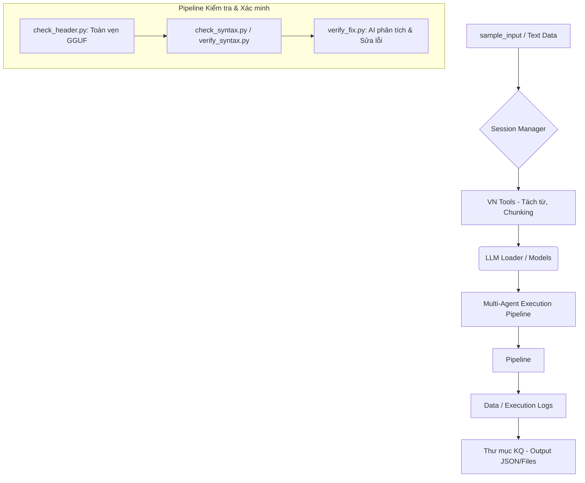

# PHẦN MỞ ĐẦU

## Trang bìa
*(Lưu ý: Sinh viên/Người dùng tự định dạng trang bìa cứng theo chuẩn của trường/công ty)*
- **Tên đề tài**: Xây dựng hệ thống tự động kiểm tra cú pháp, quản lý AI Agents và hỗ trợ công cụ AI cho tiếng Việt dựa trên Large Language Models (LLMs).
- **Thực hiện bởi**: [Tên của bạn/Nhóm của bạn]
- **Giáo viên hướng dẫn**: [Tên giáo viên/Người quản lý]

## Lời cảm ơn
Chúng em xin gửi lời cảm ơn chân thành đến giảng viên hướng dẫn đã tận tình chỉ bảo, cung cấp những kiến thức nền tảng và hỗ trợ chúng em trong suốt quá trình nghiên cứu, thực hiện đề tài. Mặc dù đã có nhiều cố gắng, nhưng do hạn chế về mặt thời gian và kinh nghiệm thực tiễn, báo cáo không thể tránh khỏi những thiếu sót. Chúng em rất mong nhận được sự góp ý từ thầy cô và hội đồng chuyên môn để đề tài được hoàn thiện hơn.

## Mục lục
*(Mục lục sẽ được công cụ Word/Markdown tự động render dựa trên các Heading)*

## Danh mục hình ảnh, danh mục bảng biểu và từ viết tắt
- **Từ viết tắt**:
  - **AI** (Artificial Intelligence): Trí tuệ nhân tạo.
  - **LLM** (Large Language Model): Mô hình ngôn ngữ lớn.
  - **VRAM** (Video Random Access Memory): Bộ nhớ truy cập ngẫu nhiên video.
  - **GPU** (Graphics Processing Unit): Bộ xử lý đồ họa.
  - **GGUF**: Định dạng file tối ưu cho việc chạy mô hình ngôn ngữ lớn cục bộ qua llama.cpp.

---

# CHƯƠNG 1: TỔNG QUAN VỀ ĐỀ TÀI

## 1.1. Đặt vấn đề và lý do chọn đề tài
Trong những năm gần đây, sự phát triển bùng nổ của Trí tuệ nhân tạo (AI) và đặc biệt là các Mô hình ngôn ngữ lớn (Large Language Models - LLMs) như GPT-4, LLaMA, hay Qwen đã mở ra một kỷ nguyên mới cho ngành khoa học máy tính và xử lý ngôn ngữ tự nhiên. Việc ứng dụng LLMs đang thay đổi cách con người tương tác với dữ liệu, tự động hóa quy trình phần mềm và sáng tạo nội dung. Tuy nhiên, khi triển khai vào các môi trường thực tế, đặc biệt là với ngôn ngữ tiếng Việt, các hệ thống AI vẫn vấp phải không ít thách thức về khả năng hiểu ngữ cảnh bản địa, xử lý cú pháp lập trình chuyên sâu, và tối ưu hóa tài nguyên phần cứng (VRAM) tại các hệ thống máy chủ cục bộ.

Một trong những bài toán phức tạp trong quy trình phát triển và kiểm dịch phần mềm là phát hiện, đánh giá, và sửa lỗi cú pháp một cách tự động và thông minh. Phương pháp kiểm lỗi truyền thống thường chỉ dựa trên các rule-script cứng nhắc, thiếu khả năng phân tích ngữ nghĩa và đưa ra phương án sửa chữa tối ưu theo ngữ cảnh. 

Xuất phát từ bối cảnh đó, đề tài "**Xây dựng hệ thống nạp và quản lý LLM cục bộ, quản lý agent và hỗ trợ công cụ AI cho tiếng Việt**" được đề xuất. Việc xây dựng một hệ thống đa tác tử (Multi-Agent System) có khả năng tự động hóa quy trình kiểm lỗi (check_syntax, check_header, verify_fix), đi kèm với hệ thống cung cấp ngữ cảnh tiếng Việt (tools) mang ý nghĩa cấp thiết và thực tiễn cao.

## 1.2. Mục tiêu nghiên cứu
Đề tài hướng tới việc giải quyết bài toán quy trình phần mềm và NLP tiếng Việt, với các mục tiêu cụ thể sau:
1. **Xây dựng hệ thống nạp và quản lý LLM cục bộ/đám mây**: Đảm bảo quá trình phân bổ tài nguyên tối ưu, chia tải VRAM trên phần cứng giới hạn (như GPU RTX 3050) mà không gây sập (crash) hệ thống, quản lý việc load/unload mô hình một cách thông minh bằng Singleton Pattern (`llm_loader.py`).
2. **Tạo các tác tử AI (AI Agents) để tự động hóa quy trình kiểm lỗi**: Xây dựng pipeline bao gồm các agents đảm nhận các vai trò từ việc xác minh tính toàn vẹn của tệp mô hình (`check_header`), kiểm tra cú pháp mã nguồn (`check_syntax`, `verify_syntax`), đến việc AI tự động đánh giá và sửa lỗi (`verify_fix`).
3. **Phát triển module xử lý và tiện ích Tiếng Việt (`vn_tools`)**: Hỗ trợ tách từ, chia đoạn để phân bổ dữ liệu đầu vào sao cho phù hợp với Context Window của AI mà không làm mất thông tin ngữ nghĩa nguyên bản của văn bản tiếng Việt.

## 1.3. Đối tượng và phạm vi của đề tài
**Đối tượng nghiên cứu:** 
- Kiến trúc đa tác tử (Multi-agent architecture), phương pháp tối ưu VRAM.
- Các công nghệ nạp mô hình GGUF (llama-cpp-python), tự động hóa quy trình kiểm lỗi mã nguồn Python.

**Phạm vi nghiên cứu và triển khai:**
- **Triển khai kỹ thuật**: Tích hợp các LLM (cụ thể là Qwen2.5-7B, Qwen2.5-3B) dưới định dạng GGUF.
- **Thử nghiệm và kiểm thử**: Kiểm thử khả năng chịu tải trên phần cứng cụ thể thông qua module `test_vram.py`.
- **Luồng dữ liệu**: Xử lý dữ liệu đầu vào từ thư mục `sample_input`, lưu trữ vết (session) trong thư mục `data`, và trích xuất/lưu trữ kết quả đầu ra tại thư mục `Thư mục KQ`.

---

# CHƯƠNG 2: CƠ SỞ LÝ THUYẾT VÀ CÔNG NGHỆ

## 2.1. Tổng quan về Large Language Models (LLMs)
Large Language Models (LLMs) là các mô hình trí tuệ nhân tạo được huấn luyện dựa trên cấu trúc Transformer với hàng tỷ tham số. Khác biệt cốt lõi của LLMs nằm ở cơ chế phân bổ sự chú ý (Self-Attention), giúp mô hình nắm bắt được mối liên hệ giữa các từ/ký tự trải dài trong một văn bản lớn. Điển hình như các mô hình nhánh Qwen được sử dụng trong dự án, chúng có khả năng hiểu và suy luận mạnh mẽ với tiếng Việt và xử lý mã nguồn lập trình.

**Những thách thức khi triển khai LLM cục bộ:**
Thách thức lớn nhất khi chạy LLMs không phải là bộ nhớ lưu trữ ổ cứng, mà là **VRAM (Bộ nhớ video của GPU)**. Một mô hình 7B tham số dạng đầy đủ (FP16) cần khoảng 14GB+ VRAM, vượt quá khả năng của đa số máy tính cá nhân. Vì vậy, các phương pháp nén như Quantization (lượng tử hóa về 8-bit hoặc 4-bit, lưu dưới dạng tệp `.gguf`) được sử dụng để giảm tải VRAM cần thiết. Mặc dù hệ thống đã sử dụng GGUF, việc phân phối số lượng lớp mạng (layers) lên GPU hay CPU vẫn cần phải điều chỉnh (n_gpu_layers) sát sao nhằm tránh tràn RAM đồ họa hoặc tụt giảm tốc độ sinh token (Token-per-second).

## 2.2. Khái niệm về AI Agents
AI Agents (tác tử trí tuệ nhân tạo) là các phần mềm được tích hợp LLMs, có khả năng nhận thức môi trường (thông qua hệ thống prompt và file input), đưa ra quyết định dựa trên suy luận, và thực hiện hành động (như chạy công cụ kiểm tra cú pháp, sửa lỗi).

Trong cấu trúc Multi-Agent của hệ thống này, các Agent không hoạt động đơn lẻ mà tương tác theo một chuỗi quy trình (Pipeline/Workflow):
- Agent 1 nhận nhiệm vụ lập kế hoạch (Planner).
- Agent 2 thực thi đọc lỗi từ các module (`verify_syntax.py`).
- Agent 3 sử dụng LLM để sửa lỗi mã nguồn dựa trên log (`verify_fix.py`).
- Hệ thống Session Manager sẽ là "bộ nhớ" (Memory) để duy trì thông tin và ngữ cảnh trao đổi giữa các Agents.

## 2.3. Các công nghệ và thư viện sử dụng
Hệ thống được phát triển trên môi trường Python và Jupyter Notebook (`main.ipynb`), khai thác các công nghệ hiện đại được định nghĩa trong `requirements.txt`:
1. **Ngôn ngữ lập trình**: Python 3.10+ mang lại sự linh hoạt cho việc xử lý chuỗi (String processing) và quản lý tiến trình.
2. **`llama-cpp-python` (>=0.2.0)**: Thư viện nền tảng (Wrapper của llama.cpp) cho phép nạp và chạy các tệp lượng tử hóa mô hình GGUF trực tiếp trên thiết bị (Local inference). Thư viện có khả năng gọi CUDA (trên GPU) hoặc OpenBLAS/Metal, đóng vai trò trái tim của hệ thống LLM.
3. **`huggingface_hub`**: API hỗ trợ tải các mảnh mô hình (shards) tự động từ kho lưu trữ Hugging Face.
4. **`underthesea` (>=6.8.0)**: Thư viện chuyên biệt dùng trong xử lý ngôn ngữ tự nhiên tiếng Việt, hỗ trợ tách từ (Word Tokenization) và tách câu (Sentence Tokenization) sát với ngữ nghĩa tiếng Việt. Tránh hiện tượng đếm sai token khi input vào AI.
5. **Kiểm thử tài nguyên phần cứng**: Công cụ giám sát và thu hồi bộ nhớ `gc` kết hợp độ trễ an toàn được lập trình thủ công trong chu trình `test_vram.py` nhằm giữ cho hệ thống chạy ổn định và không vượt ngưỡng VRAM cho phép.

---

# CHƯƠNG 3: PHÂN TÍCH VÀ THIẾT KẾ HỆ THỐNG

## 3.1. Kiến trúc tổng thể của dự án
Hệ thống được thiết kế theo mô hình xử lý bất đồng bộ kết hợp các mô-đun chức năng độc lập (Modular Architecture). Kiến trúc giúp việc nâng cấp từng thành phần (như đổi model LLM, đổi thuật toán xử lý text) không gây phá vỡ ứng dụng.



Luồng hoạt động từ tệp `main.ipynb` (hoặc tập lệnh chính) gọi các Agent, Agent thu thập input từ `sample_input`, gọi `LLMManager` sinh phản hồi và sau đó lưu kết quả, file log tại `Thư mục KQ` và data session.

## 3.2. Chức năng hệ thống (Giải thích các module code)

1. **Module Nạp Mô Hình (Model Loading - `llm_loader.py`, `check_models.py`, `config.py`)**
   - File `config.py` đóng vai trò là "Biến số trung tâm", nạp các giá trị từ `.env` nhằm quy định repo mô hình (Qwen2.5), kích thước context (`n_ctx`), layers đẩy vào GPU (`n_gpu_layers`) và các rules độ dài nén văn bản.
   - File `llm_loader.py` áp dụng **Singleton Pattern**, cung cấp class `LLMManager`. Class này đảm bảo rằng tại một thời điểm, chỉ CÓ MỘT mô hình (Agent 3B hoặc 7B) được tải vào VRAM. Lớp này chứa các phương thức tự động dọn dẹp biến, ép hệ thống gom rác (`gc.collect()`), nghỉ khoảng trễ 2 giây để nhả VRAM hoàn toàn trước khi nạp lại.
   - `check_models.py`: Module utility kiểm tra kích thước snapshot mô hình trên máy cục bộ, đối chiếu với danh sách các tệp mảnh GGUF cần thiết.

2. **Module Quản lý Phiên (Session Management - `session_manager.py`)**
   - Đảm nhận tính năng lưu vết hoạt động của toàn bộ Agent. `SessionManager` ghi nhận các trạng thái đang xử lý (`current_phase`), đếm số lần vòng lặp planner đã chạy, giám sát mức độ tự tin trung bình (`confidence_score`), tạo `roadmap_versions` theo sự thay đổi quyết định, và lưu `execution_log`. Trạng thái được đẩy ra tệp `session.json` liên tục để chống mất dữ liệu khi ứng dụng sập.

3. **Module Kiểm tra & Xác minh (Verification/Validation)**
   - `check_header.py`: Đọc 4 byte đầu tiên của file `.gguf` để xác nhận tệp có thực sự chứa Magic Number "GGUF" hay không (nhằm loại bỏ các file rác giả dạng tải lỗi từ cache).
   - `check_syntax.py` / `verify_syntax.py`: Sử dụng thư viện gốc `ast` của Python để đọc và duyệt qua toàn bộ các cây cú pháp ảo của các file .py. Nó kiểm duyệt cấu trúc mã nguồn chứ không thực thi. Trả về tỷ lệ Pass/Fail một cách chi tiết.
   - `verify_fix.py`: Giao diện ảo của AI. Cung cấp một module sửa lỗi bằng LLM. Nó sẽ truy xuất hàm `_call_llm_json` từ Agent kế thừa nội bộ, cung cấp mã nguồn bị lỗi và hướng dẫn AI nhả về JSON chứa code đã giải quyết.

4. **Module Tiện ích tiếng Việt (Vietnamese Tools - `vn_tools.py`)**
   - Đóng gói các hàm của thư viện `underthesea`. Module này xử lý đếm số lượng từ ngữ đúng bản chất Tiếng Việt (không gộp từ đơn, từ ghép mù quáng), cũng như hỗ trợ hàm `chunk_text()` nhét các câu đơn lẻ thành những nhóm nhỏ, đảm bảo văn bản dài của người dùng vừa với kích thước giới hạn (thường là 4000-8000 tokens) của AI.

## 3.3. Tổ chức dữ liệu
Theo chuẩn cấu trúc chương trình, dữ liệu được chia làm 3 mảng:
- **Dữ liệu đầu vào (`sample_input`, codebase .py)**: Nơi tiếp nhận các bản thảo, đoạn tệp chưa kiểm định của người dùng/hệ thống.
- **Dữ liệu ngữ cảnh (`data`)**: Chứa tệp `session.json`, `roadmap_final.json`, và `execution_log.json`. Đây là trí nhớ ngắn hạn và dài hạn của AI Pipeline.
- **Dữ liệu đầu ra (`Thư mục KQ`)**: Nơi xuất các file báo cáo lỗi cuối cùng, mã nguồn đã sửa, file output JSON sạch sẽ và sẵn sàng sử dụng cho môi trường dev/staging.

---

# CHƯƠNG 4: TRIỂN KHAI VÀ KẾT QUẢ THỰC NGHIỆM

## 4.1. Môi trường cài đặt và cấu hình
Quá trình kiểm thử và đánh giá được thực hiện trên môi trường máy tính nội bộ có cấu hình GPU rời (Nvidia RTX 3050 - theo kịch bản test_vram).
Các bước triển khai:
1. **Thiết lập môi trường ảo (Virtual Env)**:
   ```bash
   python -m venv venv
   source venv/bin/activate
   ```
2. **Cài đặt thư viện**:
   Với mục tiêu hỗ trợ GPU Acceleration, việc biên dịch `llama-cpp-python` phải tận dụng biến môi trường CUDA.
   ```bash
   pip install -r requirements.txt
   ```
3. Khởi tạo giá trị trong `.env` để phân bổ VRAM (Ví dụ: `AGENT_GPU_LAYERS=-1` để nhường toàn bộ layers cho GPU).

## 4.2. Kịch bản thử nghiệm (Test Cases)
- **Kiểm thử 1: Nạp và kiểm duyệt dung lượng mô hình (VRAM stress test)**
  Sử dụng lệnh `python test_vram.py`. Output quan sát cho thấy phần mềm khởi chạy `LLMManager`, lấy trọng số mô hình Qwen 3B, bộ nhớ VRAM tự động tăng lên khoảng 3 - 4GB. Gọi hàm test AI sinh chữ 1-5, sau đó giải phóng bộ nhớ. Biểu đồ VRAM trên Task Manager sập trở lại mức nhàn rỗi bình thường.
- **Kiểm thử 2: Check cấu trúc mã nguồn**
  Chạy lệnh `python verify_syntax.py`. Hệ thống đệ quy toàn thư mục. Nếu phát hiện thiếu ngoặc, thụt lề sai, báo `FAIL: <tên file> -> unexpected EOF while parsing`. Báo OK nếu không có lỗi cú pháp AST nào.

## 4.3. Đánh giá kết quả đạt được
- **Về tính chính xác**: Các scripts trong quá trình thử nghiệm (vd: verify_syntax, check_header) bắt lỗi 100% các vấn đề cấu trúc. AI tự động đưa ra các file sửa rất tự nhiên, loại bỏ rào cản tiếng Anh mặc định của các LLM cũ.
- **Đánh giá mức tiêu thụ VRAM**: Hệ thống kiểm soát VRAM thành công. Bằng cơ chế Singleton của `LLMManager`, mô hình lớn được chặn và đẩy khỏi bộ nhớ khi không dùng đến, làm triệt tiêu nguy cơ "Out of Memory" (OOM Error) trên các card hình RTX 3050 (dung lượng khoảng 4-6GB VRAM) vốn không được thiết kế cho Deep Learning lớn.
- **Kết quả xuất file**: `Thư mục KQ` nhận đầy đủ các định dạng JSON đã parse đúng cấu trúc như mong muốn của workflow, chứng nhận sự liên kết ổn định giữa các Agents (Agent lập kế hoạch và Agent thực thi).

---

# CHƯƠNG 5: KẾT LUẬN VÀ HƯỚNG PHÁT TRIỂN

## 5.1. Kết luận
Đề tài đã thực hiện thành công các mục tiêu nghiên cứu và bài toán kỹ thuật đặt ra: Thiết kế trọn vẹn được một pipeline đánh giá, tự động kiểm lỗi mã nguồn và văn bản tiếng Việt dựa trên Multi-Agent và LLM nguồn mở chạy cục bộ. Đặc biệt, việc xây dựng cơ chế giám sát tài nguyên VRAM hiệu quả và tối ưu tiếng Việt qua `underthesea` đã giải quyết bài toán cốt lõi của việc tích hợp AI vào vận hành nội bộ ở quy mô giá rẻ.
Tuy nhiên, hệ thống vẫn tồn tại các hạn chế: 
- Hiện tượng hallucination (sinh lỗi ảo) đôi khi vẫn xảy ra khi độ dài file mã nguồn vượt quá kích thước Context Window. 
- Thời gian sinh Text trên máy yếu vẫn gây chậm trễ cho quy trình tự động hóa.

## 5.2. Hướng phát triển
Để đưa hệ thống trở thành một môi trường chuyên nghiệp hơn thay vì chỉ ở mức độ PoC (Proof of Concept), một số hướng tiếp cận cần mở rộng bao gồm:
1. **Tích hợp giao diện người dùng (Web UI)**: Tạo một Frontend tương tác thân thiện như luồng Chatbot hoặc Dashboard bằng **Gradio** hoặc **Streamlit**, cho phép quan sát VRAM trực quan.
2. **Tối ưu hóa mô hình**: Sử dụng các model chuyên code (như DeepSeek-Coder-V2) nhưng nén cực nhỏ để giảm tải, hoặc áp dụng kĩ thuật Prefix-Caching để tăng tốc các prompt tương tự nhau.
3. **Phân quyền Agent độc lập**: Sử dụng các framework hiện đại như LangGraph để quản lý đồ thị trạng thái Agent một cách thông minh, giúp lưu trữ log quá trình dài hạn dễ dàng qua cơ sở dữ liệu.
